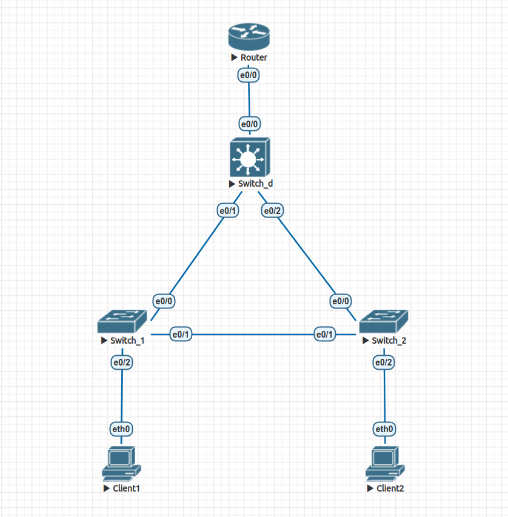

# Домашнее задание 1.

Лабораторная работа в файле *lab1.unl*. 



Линк между коммутаторами уровня доступ заблокирован протоколом STP. Проверить это можно с помощью *wireshark*.

Ниже выводы с устройств, подтверждающие работоспособность конфигурации.

***Client 1:***
```
VPCS> ip 10.0.10.2 255.255.255.0 10.0.10.1
Checking for duplicate address...
VPCS : 10.0.10.2 255.255.255.0 gateway 10.0.10.1

VPCS> show ip

NAME        : VPCS[1]
IP/MASK     : 10.0.10.2/24
GATEWAY     : 10.0.10.1
DNS         : 
MAC         : 00:50:79:66:68:05
LPORT       : 20000
RHOST:PORT  : 127.0.0.1:30000
MTU         : 1500

VPCS> ping 10.0.20.2

84 bytes from 10.0.20.2 icmp_seq=1 ttl=63 time=1.313 ms
84 bytes from 10.0.20.2 icmp_seq=2 ttl=63 time=1.377 ms
84 bytes from 10.0.20.2 icmp_seq=3 ttl=63 time=1.195 ms
84 bytes from 10.0.20.2 icmp_seq=4 ttl=63 time=1.255 ms
84 bytes from 10.0.20.2 icmp_seq=5 ttl=63 time=1.218 ms
```

***Client 1:***
```
VPCS> ip 10.0.20.2 255.255.255.0 10.0.20.1
Checking for duplicate address...
VPCS : 10.0.20.2 255.255.255.0 gateway 10.0.20.1

VPCS> show ip

NAME        : VPCS[1]
IP/MASK     : 10.0.20.2/24
GATEWAY     : 10.0.20.1
DNS         : 
MAC         : 00:50:79:66:68:06
LPORT       : 20000
RHOST:PORT  : 127.0.0.1:30000
MTU         : 1500

VPCS> ping 10.0.10.2

84 bytes from 10.0.10.2 icmp_seq=1 ttl=63 time=1.228 ms
84 bytes from 10.0.10.2 icmp_seq=2 ttl=63 time=1.132 ms
84 bytes from 10.0.10.2 icmp_seq=3 ttl=63 time=1.179 ms
84 bytes from 10.0.10.2 icmp_seq=4 ttl=63 time=1.155 ms
84 bytes from 10.0.10.2 icmp_seq=5 ttl=63 time=1.114 ms
```

***Spanning tree для Switch1:***
```
Switch#show spanning-tree 

VLAN0001
  Spanning tree enabled protocol ieee
  Root ID    Priority    32769
             Address     aabb.cc00.2000
             This bridge is the root
             Hello Time   2 sec  Max Age 20 sec  Forward Delay 15 sec

  Bridge ID  Priority    32769  (priority 32768 sys-id-ext 1)
             Address     aabb.cc00.2000
             Hello Time   2 sec  Max Age 20 sec  Forward Delay 15 sec
             Aging Time  300 sec

Interface           Role Sts Cost      Prio.Nbr Type
------------------- ---- --- --------- -------- --------------------------------
Et0/3               Desg FWD 100       128.4    P2p 


          
VLAN0010  
  Spanning tree enabled protocol ieee
  Root ID    Priority    24586
             Address     aabb.cc00.4000
             Cost        100
             Port        1 (Ethernet0/0)
             Hello Time   2 sec  Max Age 20 sec  Forward Delay 15 sec
          
  Bridge ID  Priority    32778  (priority 32768 sys-id-ext 10)
             Address     aabb.cc00.2000
             Hello Time   2 sec  Max Age 20 sec  Forward Delay 15 sec
             Aging Time  300 sec
          
Interface           Role Sts Cost      Prio.Nbr Type
------------------- ---- --- --------- -------- --------------------------------
Et0/0               Root FWD 100       128.1    P2p 
Et0/1               Desg FWD 100       128.2    P2p 
Et0/2               Desg FWD 100       128.3    P2p 
          
          
          
VLAN0020  
  Spanning tree enabled protocol ieee
  Root ID    Priority    24596
             Address     aabb.cc00.4000
             Cost        100
             Port        1 (Ethernet0/0)
             Hello Time   2 sec  Max Age 20 sec  Forward Delay 15 sec
          
  Bridge ID  Priority    32788  (priority 32768 sys-id-ext 20)
             Address     aabb.cc00.2000
             Hello Time   2 sec  Max Age 20 sec  Forward Delay 15 sec
             Aging Time  300 sec
          
Interface           Role Sts Cost      Prio.Nbr Type
------------------- ---- --- --------- -------- --------------------------------
Et0/0               Root FWD 100       128.1    P2p 
Et0/1               Desg FWD 100       128.2    P2p 
```

***Spanning tree для Switch2:***
```
Switch#show spanning-tree 

VLAN0001
  Spanning tree enabled protocol ieee
  Root ID    Priority    32769
             Address     aabb.cc00.3000
             This bridge is the root
             Hello Time   2 sec  Max Age 20 sec  Forward Delay 15 sec

  Bridge ID  Priority    32769  (priority 32768 sys-id-ext 1)
             Address     aabb.cc00.3000
             Hello Time   2 sec  Max Age 20 sec  Forward Delay 15 sec
             Aging Time  300 sec

Interface           Role Sts Cost      Prio.Nbr Type
------------------- ---- --- --------- -------- --------------------------------
Et0/3               Desg FWD 100       128.4    P2p 


          
VLAN0010  
  Spanning tree enabled protocol ieee
  Root ID    Priority    24586
             Address     aabb.cc00.4000
             Cost        100
             Port        1 (Ethernet0/0)
             Hello Time   2 sec  Max Age 20 sec  Forward Delay 15 sec
          
  Bridge ID  Priority    32778  (priority 32768 sys-id-ext 10)
             Address     aabb.cc00.3000
             Hello Time   2 sec  Max Age 20 sec  Forward Delay 15 sec
             Aging Time  300 sec
          
Interface           Role Sts Cost      Prio.Nbr Type
------------------- ---- --- --------- -------- --------------------------------
Et0/0               Root FWD 100       128.1    P2p 
Et0/1               Altn BLK 100       128.2    P2p 
          
          
          
VLAN0020  
  Spanning tree enabled protocol ieee
  Root ID    Priority    24596
             Address     aabb.cc00.4000
             Cost        100
             Port        1 (Ethernet0/0)
             Hello Time   2 sec  Max Age 20 sec  Forward Delay 15 sec
          
  Bridge ID  Priority    32788  (priority 32768 sys-id-ext 20)
             Address     aabb.cc00.3000
             Hello Time   2 sec  Max Age 20 sec  Forward Delay 15 sec
             Aging Time  300 sec
          
Interface           Role Sts Cost      Prio.Nbr Type
------------------- ---- --- --------- -------- --------------------------------
Et0/0               Root FWD 100       128.1    P2p 
Et0/1               Altn BLK 100       128.2    P2p 
Et0/2               Desg FWD 100       128.3    P2p 
```

***Spanning tree для Switch_d:***
```
Switch#show spanning-tree 

VLAN0001
  Spanning tree enabled protocol ieee
  Root ID    Priority    32769
             Address     aabb.cc00.4000
             This bridge is the root
             Hello Time   2 sec  Max Age 20 sec  Forward Delay 15 sec

  Bridge ID  Priority    32769  (priority 32768 sys-id-ext 1)
             Address     aabb.cc00.4000
             Hello Time   2 sec  Max Age 20 sec  Forward Delay 15 sec
             Aging Time  300 sec

Interface           Role Sts Cost      Prio.Nbr Type
------------------- ---- --- --------- -------- --------------------------------
Et0/3               Desg FWD 100       128.4    P2p 


          
VLAN0010  
  Spanning tree enabled protocol ieee
  Root ID    Priority    24586
             Address     aabb.cc00.4000
             This bridge is the root
             Hello Time   2 sec  Max Age 20 sec  Forward Delay 15 sec
          
  Bridge ID  Priority    24586  (priority 24576 sys-id-ext 10)
             Address     aabb.cc00.4000
             Hello Time   2 sec  Max Age 20 sec  Forward Delay 15 sec
             Aging Time  300 sec
          
Interface           Role Sts Cost      Prio.Nbr Type
------------------- ---- --- --------- -------- --------------------------------
Et0/0               Desg FWD 100       128.1    P2p 
Et0/1               Desg FWD 100       128.2    P2p 
Et0/2               Desg FWD 100       128.3    P2p 
          
          
          
VLAN0020  
  Spanning tree enabled protocol ieee
  Root ID    Priority    24596
             Address     aabb.cc00.4000
             This bridge is the root
             Hello Time   2 sec  Max Age 20 sec  Forward Delay 15 sec
          
  Bridge ID  Priority    24596  (priority 24576 sys-id-ext 20)
             Address     aabb.cc00.4000
             Hello Time   2 sec  Max Age 20 sec  Forward Delay 15 sec
             Aging Time  300 sec
          
Interface           Role Sts Cost      Prio.Nbr Type
------------------- ---- --- --------- -------- --------------------------------
Et0/0               Desg FWD 100       128.1    P2p 
Et0/1               Desg FWD 100       128.2    P2p 
Et0/2               Desg FWD 100       128.3    P2p 
```