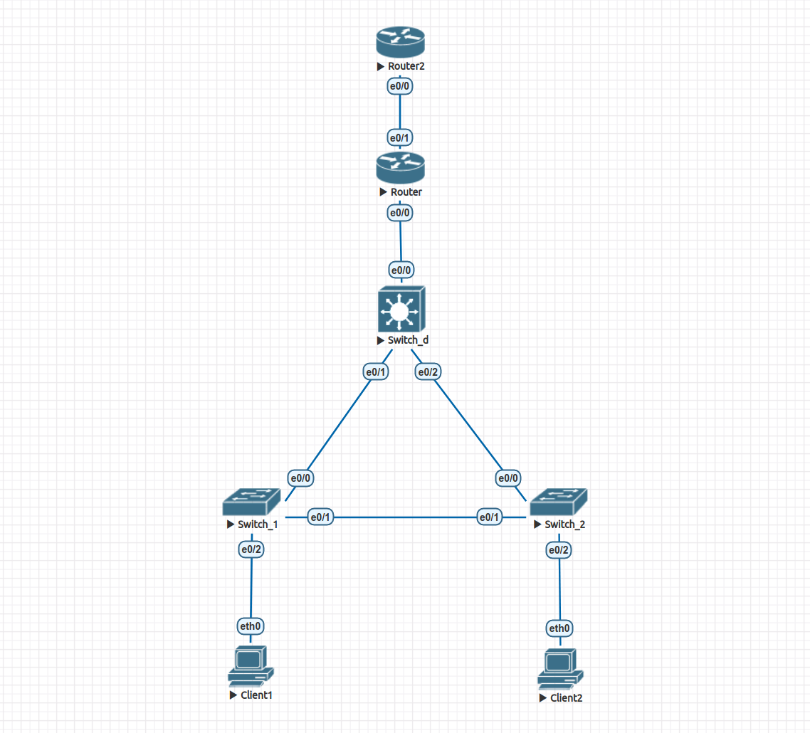

# Домашнее задание 3.

Лабораторная работа в файле *lab3.unl*. 



Клиенты получают сетевые настройки по DHCP. Проверить это можно с помощью команды `dhcp`.

Исключены первые 10 IP адресов для выдачи, настроена технология NAT.

Клиенты могут обратиться к верхнему маршрутизатору с использованием NAT и получить ответ. Проверить это можно при помощи команды `ping 128.64.2.1`.

Ниже выводы с устройств, подтверждающие работоспособность конфигурации.

***Client 1:***
```
VPCS> show ip

NAME        : VPCS[1]
IP/MASK     : 0.0.0.0/0
GATEWAY     : 0.0.0.0
DNS         : 
MAC         : 00:50:79:66:68:05
LPORT       : 20000
RHOST:PORT  : 127.0.0.1:30000
MTU         : 1500

VPCS> dhcp
DDORA IP 10.0.10.11/24 GW 10.0.10.1

VPCS> show ip

NAME        : VPCS[1]
IP/MASK     : 10.0.10.11/24
GATEWAY     : 10.0.10.1
DNS         : 8.8.8.8  
DHCP SERVER : 10.0.10.1
DHCP LEASE  : 86397, 86400/43200/75600
MAC         : 00:50:79:66:68:05
LPORT       : 20000
RHOST:PORT  : 127.0.0.1:30000
MTU         : 1500

VPCS> ping 10.0.20.11

84 bytes from 10.0.20.11 icmp_seq=1 ttl=63 time=1.934 ms
84 bytes from 10.0.20.11 icmp_seq=2 ttl=63 time=1.000 ms
84 bytes from 10.0.20.11 icmp_seq=3 ttl=63 time=1.066 ms
84 bytes from 10.0.20.11 icmp_seq=4 ttl=63 time=1.229 ms
84 bytes from 10.0.20.11 icmp_seq=5 ttl=63 time=0.988 ms

VPCS> ping 128.64.2.1

84 bytes from 128.64.2.1 icmp_seq=1 ttl=254 time=0.846 ms
84 bytes from 128.64.2.1 icmp_seq=2 ttl=254 time=0.874 ms
84 bytes from 128.64.2.1 icmp_seq=3 ttl=254 time=1.160 ms
84 bytes from 128.64.2.1 icmp_seq=4 ttl=254 time=0.806 ms
84 bytes from 128.64.2.1 icmp_seq=5 ttl=254 time=0.840 ms
```

***Client 2:***
```
VPCS> show ip 

NAME        : VPCS[1]
IP/MASK     : 0.0.0.0/0
GATEWAY     : 0.0.0.0
DNS         : 
MAC         : 00:50:79:66:68:06
LPORT       : 20000
RHOST:PORT  : 127.0.0.1:30000
MTU         : 1500

VPCS> dhcp
DDORA IP 10.0.20.11/24 GW 10.0.20.1

VPCS> show ip

NAME        : VPCS[1]
IP/MASK     : 10.0.20.11/24
GATEWAY     : 10.0.20.1
DNS         : 8.8.8.8  
DHCP SERVER : 10.0.20.1
DHCP LEASE  : 86399, 86400/43200/75600
MAC         : 00:50:79:66:68:06
LPORT       : 20000
RHOST:PORT  : 127.0.0.1:30000
MTU         : 1500

VPCS> ping 10.0.10.11

84 bytes from 10.0.10.11 icmp_seq=1 ttl=63 time=0.983 ms
84 bytes from 10.0.10.11 icmp_seq=2 ttl=63 time=1.005 ms
84 bytes from 10.0.10.11 icmp_seq=3 ttl=63 time=1.286 ms
84 bytes from 10.0.10.11 icmp_seq=4 ttl=63 time=1.009 ms
84 bytes from 10.0.10.11 icmp_seq=5 ttl=63 time=0.993 ms

VPCS> ping 128.64.2.1

84 bytes from 128.64.2.1 icmp_seq=1 ttl=254 time=0.799 ms
84 bytes from 128.64.2.1 icmp_seq=2 ttl=254 time=0.810 ms
84 bytes from 128.64.2.1 icmp_seq=3 ttl=254 time=0.878 ms
84 bytes from 128.64.2.1 icmp_seq=4 ttl=254 time=0.930 ms
84 bytes from 128.64.2.1 icmp_seq=5 ttl=254 time=0.721 ms
```