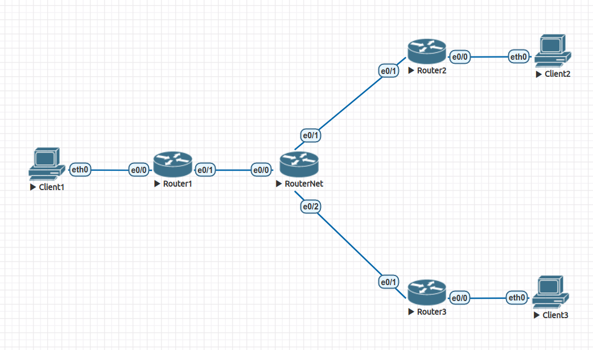

# Домашнее задание 4.

Лабораторная работа в файле *lab4.unl*. 



Построил VPN тоннели между клиентами. Траффик между клиентами Client1 и Client2 проходит через GRE тоннель без шифрования, траффик между Client1 и Client3 проходит через тоннель поверх IPSEC с шифрованием (SHA).

Ниже выводы с устройств, подтверждающие работоспособность конфигурации.

***Client 1:***
```
VPCS> ip 10.0.10.2 225.255.255.0 10.0.10.1
Checking for duplicate address...
VPCS : 10.0.10.2 255.255.255.0 gateway 10.0.10.1

VPCS> ping 10.0.20.2

84 bytes from 10.0.20.2 icmp_seq=1 ttl=62 time=1.147 ms
84 bytes from 10.0.20.2 icmp_seq=2 ttl=62 time=0.693 ms
84 bytes from 10.0.20.2 icmp_seq=3 ttl=62 time=0.735 ms
84 bytes from 10.0.20.2 icmp_seq=4 ttl=62 time=0.668 ms
84 bytes from 10.0.20.2 icmp_seq=5 ttl=62 time=0.708 ms

VPCS> ping 10.0.30.2

84 bytes from 10.0.30.2 icmp_seq=1 ttl=62 time=1.148 ms
84 bytes from 10.0.30.2 icmp_seq=2 ttl=62 time=0.772 ms
84 bytes from 10.0.30.2 icmp_seq=3 ttl=62 time=0.767 ms
84 bytes from 10.0.30.2 icmp_seq=4 ttl=62 time=0.764 ms
84 bytes from 10.0.30.2 icmp_seq=5 ttl=62 time=0.790 ms
```

***Client 2:***
```
VPCS> ip 10.0.20.2 255.255.255.0 10.0.20.1
Checking for duplicate address...
VPCS : 10.0.20.2 255.255.255.0 gateway 10.0.20.1

VPCS> ping 10.0.10.2

84 bytes from 10.0.10.2 icmp_seq=1 ttl=62 time=0.756 ms
84 bytes from 10.0.10.2 icmp_seq=2 ttl=62 time=0.752 ms
84 bytes from 10.0.10.2 icmp_seq=3 ttl=62 time=0.737 ms
84 bytes from 10.0.10.2 icmp_seq=4 ttl=62 time=0.669 ms
84 bytes from 10.0.10.2 icmp_seq=5 ttl=62 time=0.640 ms
```

***Client 3:***
```
VPCS> ip 10.0.30.2 255.255.255.0 10.0.30.1
Checking for duplicate address...
VPCS : 10.0.30.2 255.255.255.0 gateway 10.0.30.1

VPCS> ping 10.0.10.2

84 bytes from 10.0.10.2 icmp_seq=1 ttl=62 time=0.835 ms
84 bytes from 10.0.10.2 icmp_seq=2 ttl=62 time=0.802 ms
84 bytes from 10.0.10.2 icmp_seq=3 ttl=62 time=0.806 ms
84 bytes from 10.0.10.2 icmp_seq=4 ttl=62 time=0.818 ms
84 bytes from 10.0.10.2 icmp_seq=5 ttl=62 time=0.795 ms
```